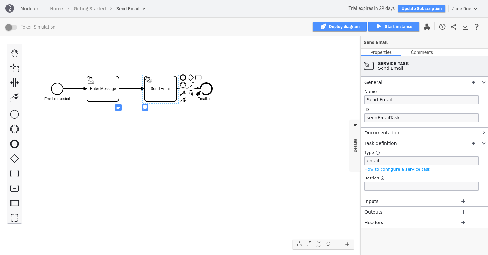
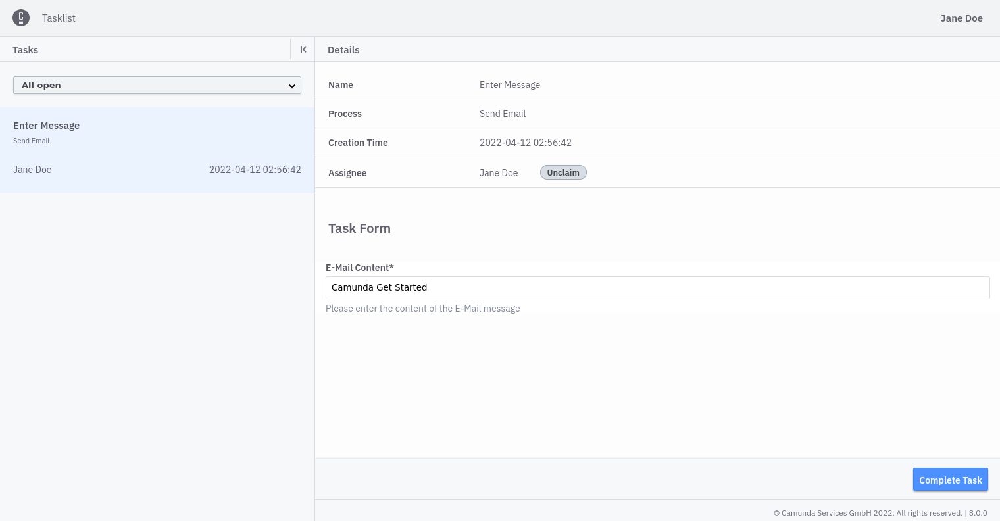

# Camunda Cloud - Get Started

This repository contains a short guide to get started with [Camunda
Cloud](https://camunda.com/products/cloud/). It contains instructions on how to
model your first process, create a user task form, and automate a service task.
During the guide you will use Console, Modeler, Zeebe, Operate, and Tasklist.

# Table of contents

* [Repository structure](#repository-structure)
* [Setup the environment](#set-up-the-environment)
* [Model the process](#model-the-process)
   * [Model the user task form](#model-the-user-task-form)
   * [Configure user task to use form](#configure-user-task-to-use-form)
   * [Configure service task](#configure-service-task)
* [Deploy process](#deploy-process)
   * [Deploy using Camunda Modeler](#deploy-using-camunda-modeler)
   * [Deploy using Camunda Cloud](#deploy-using-camunda-cloud)
   * [Deploy using zbctl](#deploy-using-zbctl)
   * [Deploy using code](#deploy-using-code)
* [Start process instance](#start-process-instance)
   * [Start instance using Camunda Modeler](#start-instance-using-camunda-modeler)
   * [Start instance using Camunda Cloud](#start-instance-using-camunda-cloud)
   * [Start instance using zbctl](#start-instance-using-zbctl)
   * [Start instance using code](#start-instance-using-code)
* [Complete the user task](#complete-the-user-task)
* [Complete the service task](#complete-the-service-task)
* [Further references](#further-references)
* [Local setup](#local-setup)

# Repository structure

The repository contains the following folders:

- [_images_](images/) - Contains screenshots and images for the guide
- [_java_](java/) - Plain Java example for deploy, create instance, and a job worker
- [_nodejs_](nodejs/) - Node.js example for deploy, create instance, and a job worker
- [_csharp_](csharp/) - C# example for deploy, create instance, and a job worker
- [_process_](process/) - Contains the BPMN process and the user task form
- [_spring_](spring/) - Spring Boot example for deploy, create instance, and a job worker

# Set up the environment

To follow this guide, we need a running Camunda Cloud cluster. For this purpose,
we use the Camunda Cloud SaaS offering at https://camunda.io.

If you prefer a local setup, visit the [end of this guide](#local-setup).

After the sign-up and log-in at https://camunda.io, a cluster is already available with the latest stable version of Zeebe and the name **Test Cluster**.


If there is no cluster available, [create a new
one](https://docs.camunda.io/docs/product-manuals/cloud-console/manage-clusters/create-cluster)
with the latest stable version of Zeebe.

After the cluster is available, we need to create a pair of [Client
Credentials](https://docs.camunda.io/docs/product-manuals/cloud-console/manage-clusters/manage-api-clients).
To do this, take the following steps:

1. Navigate to the **Clusters** detail page.
2. Switch to the **API** tab.
3. Create a new client credential and either note down the **client id** and **client secret**, or
download the credentials file.

# Model the process

In this example, we'll model a simple process to send an email message.

Camunda Cloud allows you to use the
[BPMN](https://docs.camunda.io/docs/reference/bpmn-workflows/bpmn-primer)
standard to model your business processes. The process consists of two
tasks: a user task to allow a human to enter the message content, and a service
task to automatically send the email message.


**Note**: To keep the scope of this guide easy to follow, we only build the
scaffolding for this process automation example and will not actually send
an email. This can be a task for you to extend the example and connect to a mail
provider.

To create the process, we use the desktop [Camunda Modeler] or [Cloud
Modeler].


Find the finished process at [process/send-email.bpmn](process/send-email.bpmn).

## Model the user task form

To help users complete the user task **Enter Message**, we create a user
task form using the modeler.

Use [Camunda Modeler] or [Cloud Modeler] to create the form.


Find the finished form at [process/enter-email-message.form](process/enter-email-message.form).

## Configure user task to use form

Now that we've created a form, we must configure the user task to use the form.
To do this, we copy the JSON content of the form into the **Form Json
Configuration** field under the **Forms** tab of the modeler.


## Configure service task

The last step is defining the job type of the service task. The job type is
needed for a job worker to subscribe to the jobs of the task and
complete them. The [Camunda Cloud Documentation] contains more information about
[job workers](https://docs.camunda.io/docs/product-manuals/concepts/job-workers).



# Deploy process

Deploy the process using [Camunda
Modeler](#deploy-using-camunda-modeler), [Cloud
Modeler](#deploy-using-camunda-cloud), [zbctl](#deploy-using-zbctl), or your [own
code](#deploy-using-code).

## Deploy using Camunda Modeler

To deploy the [process](process/send-email.bpmn) using Camunda Modeler,
follow these steps:

1. Select **Deploy current diagram**.
    
2. Configure the endpoint for the deployment. For Camunda Cloud,
   you need the cluster id from the cluster details page, and the [client
   credentials](#-cloud) you created.
    

## Deploy using Cloud Modeler

To deploy the [process](process/send-email.bpmn) using Cloud Modeler,
follow these steps:

1. Select **Deployment > Save and Deploy**.
    
2. Select the cluster to deploy the diagram on.
    

## Deploy using zbctl

To the deploy the [process](process/send-email.bpmn) using `zbctl`, use the
following command:

```bash
zbctl deploy send-email.bpmn \
  --address 365eed98-16c1-4096-bb57-eb8828ed131e.zeebe.camunda.io:443 \
  --clientId 'GZVO3ALYy~qCcD3MYq~sf0GIszNzLE_z' \
  --clientSecret '.RPbZc6q0d6uzRbB4LW.B8lCpsxbBEpmBX0AHQGzINf3.KK9RkzZW1aDaZ-7WYNJ'
```

For **Camunda Cloud**, we need the cluster id and the [client
credentials](#setup-the-environment).

## Deploy using code

Writing your own code allows you to deploy the process (for example, on application
startup) to ensure the latest version is deployed. To see examples of
this, visit the programming language [specific folders](#repository-structure).

# Start process instance

Start a new instance of the process using [Camunda
Modeler](#start-instance-using-camunda-modeler), [Cloud
Modeler](#start-instance-using-camunda-cloud), [zbctl](#start-instance-using-zbctl), or your [own
code](#start-instance-using-code).

## Start instance using Camunda Modeler

After the process is deployed, click **Start Current Diagram** to start an instance of the process with Camunda Modeler.


## Start instance using Cloud Modeler

To start an instance of the process using Cloud Modeler, follow these steps:

1. Select **Deployment > Start Instance**.

2. Specify **optional** [process
   variables](https://docs.camunda.io/docs/product-manuals/concepts/variables)
   before starting the instance.


## Start instance using zbctl

To start a process instance of the BPMN process id `send-email` using `zbctl`,
use the following command:

```bash
zbctl create instance send-email \
  --address 365eed98-16c1-4096-bb57-eb8828ed131e.zeebe.camunda.io:443 \
  --clientId 'GZVO3ALYy~qCcD3MYq~sf0GIszNzLE_z' \
  --clientSecret '.RPbZc6q0d6uzRbB4LW.B8lCpsxbBEpmBX0AHQGzINf3.KK9RkzZW1aDaZ-7WYNJ'
```

For **Camunda Cloud**, we need the cluster id and the [client
credentials](#setup-the-environment).

## Start instance using code

Writing your own code allows you to start an instance of the process on an
external trigger, like an incoming message or a user request. To see examples of this,
visit the programming language [specific folders](#repository-structure).

# Complete the user task

The first task of the process is the [user
task](https://docs.camunda.io/docs/reference/bpmn-workflows/user-tasks/user-tasks)
**Enter Message**.


To complete the user task, we use Tasklist. To do this, visit the cluster's
details page in Camunda Cloud and launch Tasklist.

Take the following steps:

1. In Tasklist, select the **Enter Message** task from the list of tasks.
2. Click the **Claim** button to assign the task to you to work on it.
3. Fill out the **E-Mail Content** field with the message you want to send.
4. Select **Complete Task**.



# Complete the service task

The second task of the process is the [service
task](https://docs.camunda.io/docs/reference/bpmn-workflows/service-tasks/service-tasks)
**Send Email**.


To complete the service task, we need to implement the business logic. Therefore, we must create a [job
worker](https://docs.camunda.io/docs/product-manuals/concepts/job-workers) for
the task type we defined in the diagram. The job worker will subscribe to all
jobs with the same task type.

To define the task type, we select the service task in the diagram and use
the properties panel to set the task type to `email`.


To implement the logic, we implement a job worker. Check out the
programming language [specific folders](#repository-structure) to find the job
worker implementations.

# Further references

Find more information in the [Camunda Cloud Documentation], or join the [Camunda Cloud
Forum](https://forum.camunda.io) and [Camunda Cloud
Slack](https://camunda-cloud.slack.com) community.

## Local setup

To run the getting started guide against a locally-hosted instance, set up the following
components:

- [Zeebe](https://docs.camunda.io/docs/product-manuals/zeebe/deployment-guide/local/install)
- [Operate](https://docs.camunda.io/docs/product-manuals/operate/deployment/install-and-start)
- [Tasklist](https://docs.camunda.io/docs/product-manuals/tasklist/deployment/install-and-start)
- [Camunda Modeler](https://docs.camunda.io/docs/product-manuals/modeler/camunda-modeler/install-the-modeler)

If docker is available in your system, the `docker-compose.yaml` in the root
folder can be used to spin up a local environment.

```
docker-compose --profile full up -d
```

After this, Zeebe is available under `localhost:26500`. Disable security
inside the client when connecting to it.

Operate will be available under http://localhost:8080 and Tasklist will be
available under http://localhost:8081.

See the following additional resources:

- [Camunda Modeler]
- [Cloud Modeler]
- [Camunda Cloud Documentation]

[Camunda Modeler]: https://camunda.com/download/modeler/
[Cloud Modeler]: https://docs.camunda.io/docs/product-manuals/modeler/cloud-modeler/launch-cloud-modeler
[Camunda Cloud Documentation]: https://docs.camunda.io

## Dev setup

The `docker-compose.yaml` uses profiles to configure the environment to your needs.  

Use the default profile to run only Zeebe and Elasticsearch but no web-apps.

```
docker-compose up -d
```

Use the `dev` profile to run Zeebe, Elasticsearch and Kibana. Kibana can be used to inspect the data
that is stored in Elasticsearch.

```
docker-compose --profile dev up -d
```

After the services are started, Kibana is available under http://localhost:5601.
